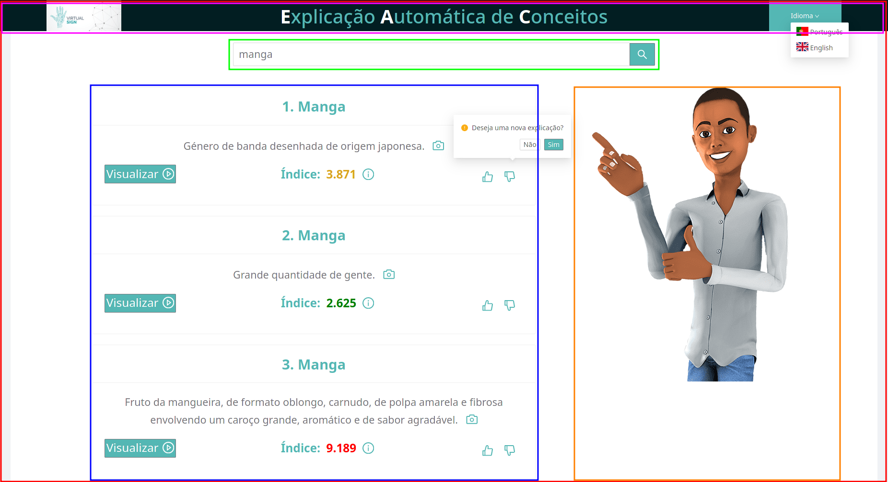

# Website

This folder contains the files responsible for creating the WebApp.

This project was bootstrapped with [Create React App](https://github.com/facebook/create-react-app).

## How to run the WebApp

It is required to have [Node.js](https://nodejs.org/en/) installed for this application.

All the dependencies are automatically installed using the following command:

```bash
npm install
```

After installation, the app can be run in the development mode, using the following command:

```bash
npm start
```

It will automatically open a browser page at [http://localhost:3000](http://localhost:3000) to view it.

The page will reload after saved edits.
It will also show any lint errors in the console.

## Content

All the developed files are in the `src` folder which has the following content:

* apis - Contains the [axios](https://www.npmjs.com/package/axios) connection to the API.
* assets - Contains the assets to be used in the webapp, namely fonts and images.
* components - Contains all the created react components.
The following image, shows how each component is integrated in the app.



**Color subtitle:**

*  app
*  avatar
*  display
*  navbar
*  search

## Other Available Scripts

In the project directory, you can run:

```bash
npm test
```

Launches the test runner in the interactive watch mode.<br />
See the section about [running tests](https://facebook.github.io/create-react-app/docs/running-tests) for more information.

```bash
npm run build
```

Builds the app for production to the `build` folder.<br />
It correctly bundles React in production mode and optimizes the build for the best performance.

The build is minified and the filenames include the hashes.<br />
Your app is ready to be deployed!

See the section about [deployment](https://facebook.github.io/create-react-app/docs/deployment) for more information.

```bash
npm run eject
```

**Note: this is a one-way operation. Once you `eject`, you can’t go back!**

If you aren’t satisfied with the build tool and configuration choices, you can `eject` at any time. This command will remove the single build dependency from your project.

Instead, it will copy all the configuration files and the transitive dependencies (webpack, Babel, ESLint, etc) right into your project so you have full control over them. All of the commands except `eject` will still work, but they will point to the copied scripts so you can tweak them. At this point you’re on your own.

You don’t have to ever use `eject`. The curated feature set is suitable for small and middle deployments, and you shouldn’t feel obligated to use this feature. However we understand that this tool wouldn’t be useful if you couldn’t customize it when you are ready for it.

